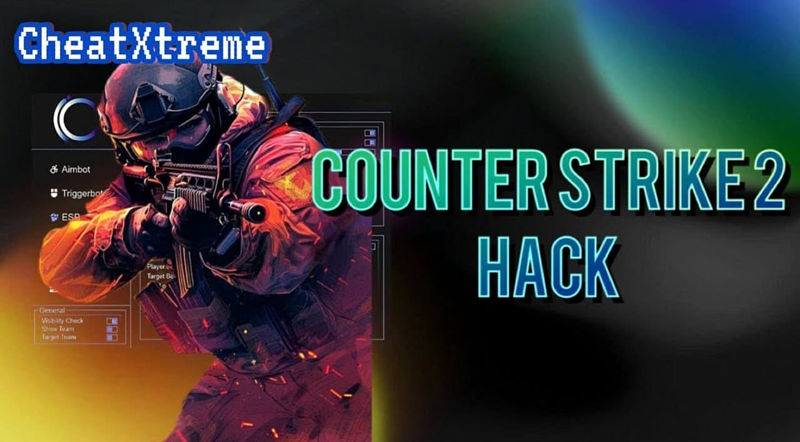

🎡 CS2 External ESP

Welcome to Cheat-CS2, an external cheat for Counter-Strike 2 designed to enhance your Windows API skills while providing various features to give you an edge in the game. This cheat operates independently of the game's memory and offers functionalities like AimBot, ESP with visual aids, Trigger Bot, BunnyHop, and automatic offset updates.

Features
AimBot
The AimBot feature in Cheat-CS2 assists you in aiming at your opponents with precision, making your shots more accurate and lethal.

ESP with Visual Aids
With ESP and various visual aids, you can track the positions of your enemies easily, giving you the strategic advantage during gameplay.

Trigger Bot
The Trigger Bot feature automatically shoots when your crosshair is on an enemy, ensuring rapid and precise targeting.

BunnyHop
Utilize BunnyHop to navigate the map swiftly by hopping continuously, enhancing your movement speed and agility.

Usage
Follow these steps to make the most of Cheat-CS2:

Download the Loader.zip
Extract the files to a folder on your computer.
Run the Loader.exe before launching Counter-Strike 2.
Customize the cheat settings based on your preferences.
Enjoy enhanced gameplay with Cheat-CS2 features.

Support
If you encounter any issues or have questions about Cheat-CS2, feel free to contact us at support@cheat-cs2.com.

